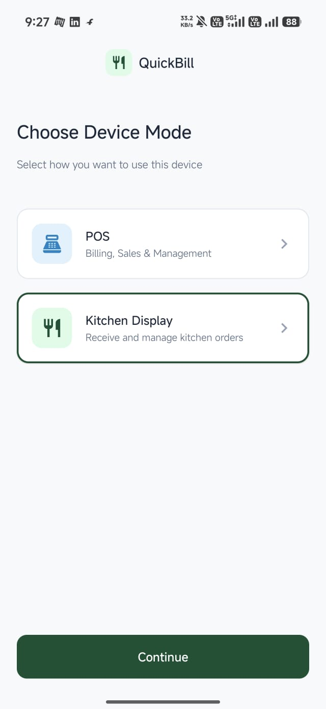
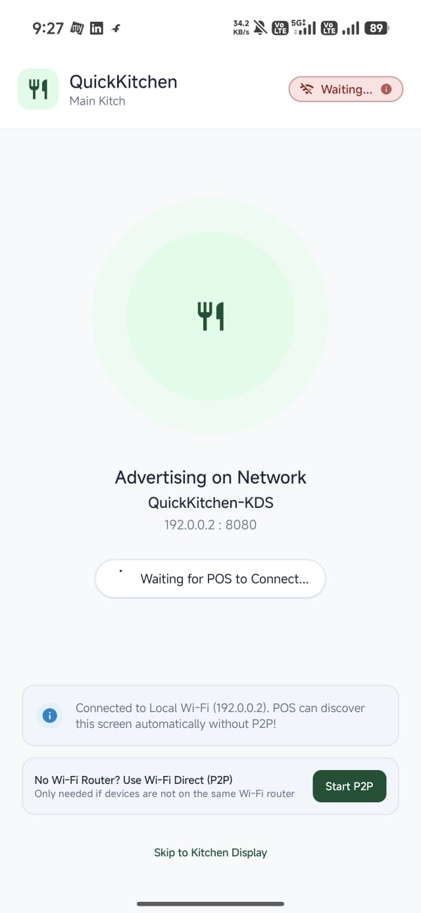
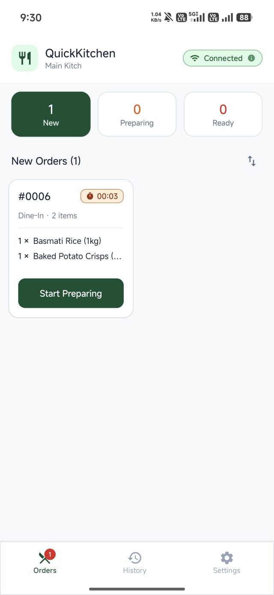
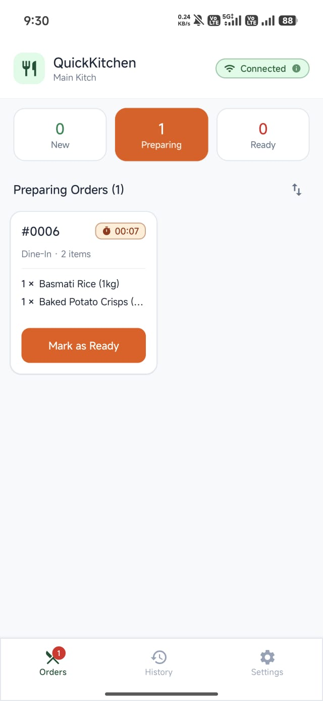
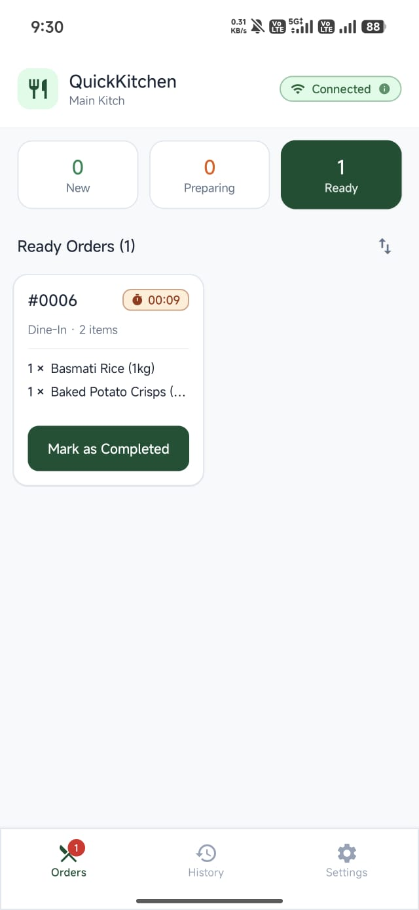
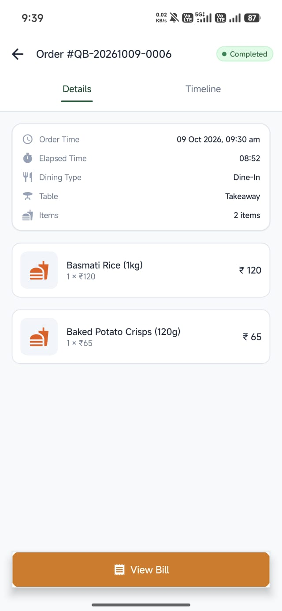
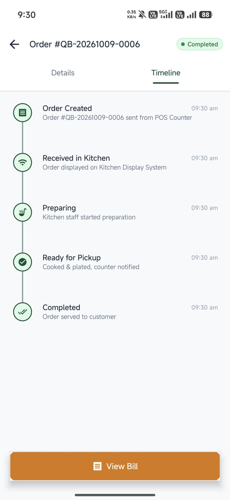
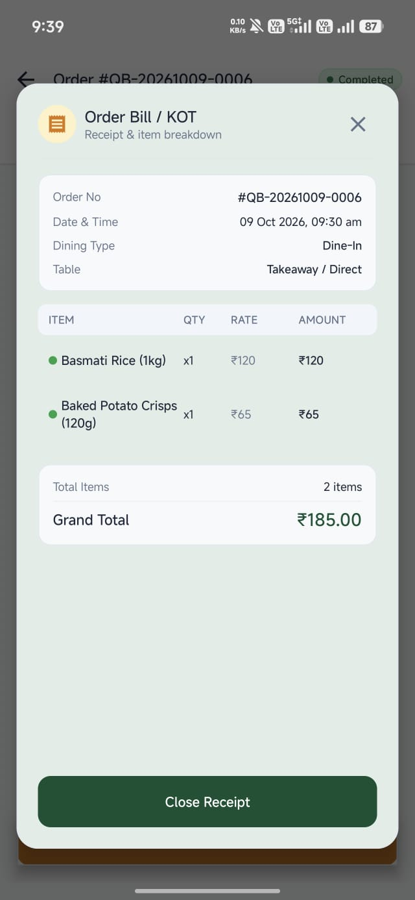
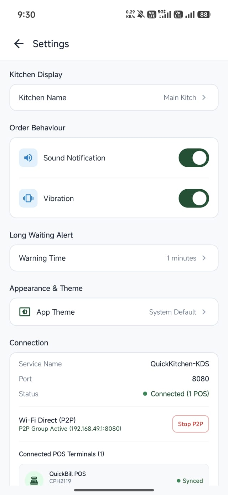
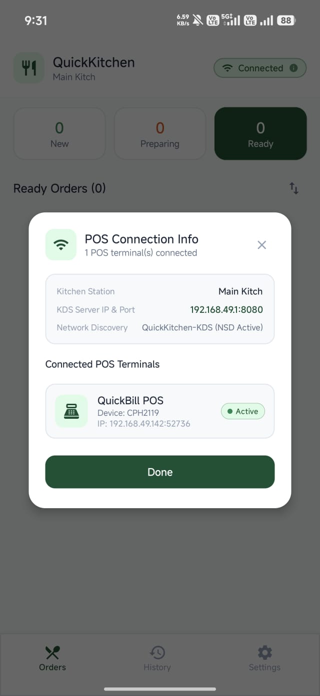

# QuickBill POS & QuickKitchen KDS

[-brightgreen.svg)](https://developer.android.com)
[](https://developer.android.com)
[](https://kotlinlang.org)
[](https://developer.android.com/jetpack/compose)
[](https://developer.android.com/training/data-storage/room)
[](https://insert-koin.io)
[](https://github.com/TooTallNate/Java-WebSocket)
[](#-dual-network-connectivity-modes)
[-blue.svg)](AUTHORS.md)
[](SOURCE_MANIFEST.json)

An offline-first Android Point of Sale (POS) and **QuickKitchen Kitchen Display System (KDS)** packaged into **a SINGLE Android APK / Single Android project**.

The same APK can be installed on two Android devices:
- **Device 1**: Operates in **POS Mode** (Billing Terminal, Inventory, Payments, Split Tender, Barcode Scanning, PDF Thermal Receipts).
- **Device 2**: Operates in **KDS Mode** (Kitchen Display System with live elapsed timers, overdue preparation alerts, audio/haptic chimes, and stage management).
- **Dual Local Sync Options**:
  1. **Wi-Fi / Hotspot Mode**: Autonomous mDNS discovery via **Android NSD (`_quickbill._tcp`)** and persistent local **WebSocket** communication.
  2. **Wi-Fi Direct (P2P) Mode**: Routerless direct device-to-device communication using **Android Wi-Fi P2P framework**, allowing seamless operation even in outdoor or router-free food truck environments.
  3. **Zero Cloud Dependencies**: 100% local communication with zero recurring server bills or cloud outages.
  4. **Durable Outbox Queue**: Room-backed event store (`pending_events`) with automatic FIFO replay and duplicate event prevention (`received_events`).

---

## 📱 Application Screenshots

### 🏪 QuickBill POS Terminal Screenshots

| Cashier Login | POS Billing Terminal | Live Cart & Discounts |
|:---:|:---:|:---:|
|  |  |  |

| Payment & Split Tender | Thermal Receipt & PDF | Navigation Drawer |
|:---:|:---:|:---:|
|  |  |  |

| Product Inventory Management | Sales History & Refunds | Daily Analytics & Top Items |
|:---:|:---:|:---:|
|  |  |  |

### 🍳 QuickKitchen KDS (Kitchen Display System) Screenshots

| Device Mode Selection | Waiting for Connection | Kitchen Display (Start / Pending) |
|:---:|:---:|:---:|
|  |  |  |

| Kitchen Display (Preparing) | Kitchen Display (Ready) | Order Details & Item Status |
|:---:|:---:|:---:|
|  |  |  |

| Order Timeline & History | Bill Receipt & Verification | Kitchen Settings & Customization |
|:---:|:---:|:---:|
|  |  |  |

| Live Connection Status & Diagnostics |
|:---:|
|  |

---

## 🎥 App Demo

https://github.com/user-attachments/assets/bc846318-5078-4a18-9535-238c53512a0a

---

## 📦 Download APK Build

Download and install the pre-compiled APK directly on any Android Phone:

| Build Variant | Architecture | APK Size | Direct Download |
|---|---|---|---|
| **QuickBill POS & QuickKitchen KDS (Release Build)** | `arm64-v8a`, `armeabi-v7a` | **11.6 MB** | [📥 **Download app-release.apk**](apk/app-release.apk) |

> **Single APK Dual-Mode**: Install the exact same APK on both devices. On first launch, select **POS** on Device 1 and **KDS** on Device 2. Switch roles anytime via *Settings → Change Device Mode*.

### Quick Installation:
1. **Direct on Device**: Download the APK file on your Android device, tap to open, and allow *"Install unknown apps"* if prompted.
2. **Via ADB**:
   ```bash
   adb install -r apk/app-release.apk
   adb shell am start -n com.quickbill.pos/.MainActivity
   ```

---

## 🍳 QuickKitchen KDS & Dual-Device Setup

### How Dual-Device Communication Works
```
+-----------------------------+                  +-----------------------------+
|        DEVICE 1: POS        |                  |        DEVICE 2: KDS        |
|  (Billing & Checkout Desk)  |                  |    (Kitchen Food Station)   |
+-----------------------------+                  +-----------------------------+
              |                                                 |
  DISCOVERY:  | Mode A: Auto-discover via NSD (_quickbill._tcp) | Mode A: Advertises on Port 8887
              | Mode B: Wi-Fi Direct P2P Device Discovery       | Mode B: Advertises P2P Kitchen Group
              |------------------------------------------------>|
              |                                                 |
              | 2. Persistent Bidirectional WebSocket           | Listens for POS clients
              |<===============================================>|
              |                                                 |
  Checkout -> | 3. ORDER_CREATED event                          |
  Completed   |------------------------------------------------>| -> Sound & Vibration Alert
              |                                                 | -> Live Elapsed Timer Starts
              | 4. ORDER_ACK (Event processed & deduplicated)   |
              |<------------------------------------------------|
              |                                                 |
              |                                                 | Chef taps "Start Preparing"
              | 5. STATUS_CHANGED (PREPARING / READY / DONE)    | or "Mark Ready"
              |<------------------------------------------------|
              |                                                 |
  Offline? -> | 6. Stores in Room Outbox (`pending_events`)     |
              |    Auto-drains in FIFO order upon reconnect     |
+-----------------------------+                  +-----------------------------+
```

### 📡 Dual Network Connectivity Modes

QuickBill + QuickKitchen provides **two independent local connection mechanisms**:

#### Mode 1: Wi-Fi / Hotspot (Standard LAN via NSD)
- Both devices connect to the same Wi-Fi router or one phone turns on a Mobile Hotspot.
- **KDS** starts an embedded WebSocket server and registers an Android Network Service Discovery (NSD) service under `_quickbill._tcp`.
- **POS** scans the local network via `NsdManager`, resolves the KDS IP and port, and connects automatically with one tap.

#### Mode 2: Wi-Fi Direct / P2P (No Router or Internet Needed)
- Ideal for food trucks, pop-up stalls, and outdoor venues without a Wi-Fi router.
- **KDS** advertises as a Wi-Fi Direct host / Group Owner.
- **POS** discovers nearby kitchen devices via Android's `WifiP2pManager`.
- Tapping **Connect** initiates a direct Wi-Fi Direct P2P pairing and routes the WebSocket stream directly over the peer-to-peer IP link (`192.168.49.1`).
- The connection dialog provides live scanning, RSSI indicators, and an automated framework reset/disconnect action.

---

### Step-by-Step 2-Device Demo Instructions:

1. **Choose Connectivity**:
   - **Option A (Wi-Fi/Hotspot)**: Connect both devices to the same Wi-Fi network (or host device hotspot).
   - **Option B (Wi-Fi Direct)**: Turn on Wi-Fi and Location on both devices (no router required).
2. **Device 1 (Counter / POS)**:
   - Launch QuickBill.
   - On the first-launch screen, select **"POS Mode (Point of Sale)"**.
   - Login with default credentials: `admin` / `1234`.
3. **Device 2 (Kitchen / KDS)**:
   - Launch QuickBill.
   - On the first-launch screen, select **"KDS Mode (QuickKitchen Display)"**.
   - The kitchen dashboard starts its embedded server on port `8887` and displays its local endpoint.
4. **Connecting the Devices**:
   - On Device 1 (POS), tap the **`KDS`** status chip on the top bar.
   - In the **Kitchen Connection Dialog**, choose your preferred tab:
     - **Wi-Fi / Hotspot**: Tap **Connect** next to the discovered `QuickKitchen-KDS` unit (or enter IP manually).
     - **Wi-Fi Direct (P2P)**: Tap **Scan Nearby Kitchens**, select the KDS device, and tap **Connect**.
   - The status chip turns **🟢 Connected to Kitchen**.
5. **Placing & Fulfilling an Order**:
   - On POS, add products to cart and tap **Proceed to Payment**.
   - Complete checkout (Cash/Card/UPI/Split).
   - **Instantly**, Device 2 (Kitchen) plays an alert chime, vibrates, and adds the order ticket with item lines, customizations, and a live timer (`00:01`, `00:02`...).
   - If food preparation exceeds the configured threshold (default 5 min), the card triggers an amber/red **⚠️ LATE** overdue indicator.
   - Kitchen staff taps **[Start Preparing]** (`PREPARING`) → status syncs back to POS.
   - Kitchen staff taps **[Mark Ready]** (`READY`) → signals food pickup.
   - Kitchen staff taps **[Complete Order]** → archives ticket to the Kitchen History screen.
6. **Testing Offline Resilience**:
   - Disable Wi-Fi on POS.
   - Complete 2 sales on POS. The top bar chip displays `🔴 KDS Offline (2 queued)`.
   - Reconnect Wi-Fi / P2P. The Room outbox immediately drains in FIFO sequence, delivering all queued orders to KDS without data loss or duplicate tickets.

---

## 🏗️ Tech Stack & Directory Structure

```
com.quickbill.pos/
├── app/
│   └── QuickBillApp.kt             # Application class; initializes Koin, seeds defaults, restores session
├── data/
│   ├── local/
│   │   ├── QuickBillDatabase.kt    # Room DB definition (entities, converters, versioning)
│   │   ├── Converters.kt           # Room TypeConverters for Enums
│   │   ├── dao/                    # ProductDao, BillDao, BillItemDao, BillPaymentDao, HeldCartDao,
│   │   │                           # OrderDao, PendingEventDao, ReceivedEventDao, UserDao
│   │   └── entity/                 # ProductEntity, BillEntity, BillItemEntity, BillPaymentEntity,
│   │                               # HeldCartEntity, OrderEntity, OrderItemEntity, PendingEventEntity,
│   │                               # ReceivedEventEntity, UserEntity
│   ├── model/                      # CartItem, CartSummary, PaymentSplit, DailyReportData, Enums, KdsModels
│   ├── repository/                 # AuthRepository, BillingRepository, ProductRepository,
│   │                               # ReportRepository, ThemeRepository, DeviceModeRepository, KdsSettingsRepository
│   ├── seed/                       # SampleDataSeeder (default cashiers & starter product catalog)
│   └── util/
│       ├── BillingCalculator.kt    # Pure Kotlin calculations (tax, discounts, splits, change due)
│       ├── PdfReceiptGenerator.kt  # Android Graphics/PdfDocument 80mm thermal receipt generator
│       ├── CsvExporter.kt          # Storage/Share-compatible CSV report exporter
│       └── NetworkMonitor.kt       # ConnectivityManager Flow-based network observer
├── di/
│   └── AppModule.kt                # Koin dependency injection module (DAOs, Repos, ViewModels)
├── network/
│   └── kds/
│       ├── ConnectionManager.kt          # Unified network coordinator (Wi-Fi + Wi-Fi Direct switching)
│       ├── NsdDiscoveryManager.kt        # Android NSD mDNS advertising and discovery
│       ├── WifiP2pConnectionManager.kt   # Wi-Fi Direct P2P discovery, pairing, and group handling
│       ├── WebSocketManager.kt           # Embedded Java-WebSocket server (KDS) & client (POS)
│       ├── OutboxManager.kt              # Room-backed transactional outbox with auto-retry
│       └── OrderSyncManager.kt           # Bidirectional event serializer, ACK handler & deduplicator
├── ui/
│   ├── components/                 # Reusable UI widgets, dialogs (TopBar, NavDrawer, KdsConnectionDialog, etc.)
│   ├── navigation/                 # Navigation Compose routes & Screen sealed classes
│   ├── screens/
│   │   ├── auth/                   # Cashier login & PIN entry
│   │   ├── billing/                # Terminal cart, barcode lookup, held carts
│   │   ├── dashboard/              # Store analytics summary, quick actions, KPI cards
│   │   ├── history/                # Searchable sales history, calendar range picker, refund
│   │   ├── kitchen/                # KDS ticket grid, timers, audio/vibe alerts, history, settings
│   │   ├── mode/                   # Initial device mode selector (POS vs KDS)
│   │   ├── products/               # Product catalog, SKU duplicate guard, stock adjustments
│   │   └── reports/                # Daily sales breakdown, top selling items, CSV export
│   └── theme/                      # Material 3 color system, shapes, typography, motion specs
```

### Verification & Tooling:
```
tools/
├── apply_author_headers.py        # Automated header applicator for Kotlin, XML, and Gradle files
├── generate_source_manifest.py    # Generates authoritative SHA-256 manifest (SOURCE_MANIFEST.json)
├── verify_authorship.py           # Validates presence of author attribution marker
└── verify_source_integrity.py     # Validates file integrity, detects modifications and deletions

docs/
├── AUTHORSHIP_AND_INTEGRITY.md       # Technical explanation of attribution and tamper detection
└── AUTHORSHIP_IMPLEMENTATION_REPORT.md# Complete 10-point implementation report
```

---

## 🛠️ Architectural & Business Logic Assumptions

1. **Strict Offline-First**:
   - The app does not require external internet or cloud backends to complete sales, manage stock, or generate reports.
   - Terminal operations are never blocked by network state.
2. **Atomic Inventory Transactions**:
   - Sales decrement item stock inside a database `@Transaction`. If stock is insufficient, checkout fails cleanly.
   - Refunding a bill rolls back inventory stock for all associated line items inside a database transaction.
3. **Non-Destructive Soft Deletes**:
   - Archiving products sets `isArchived = 1` rather than raw deletion, preserving past transaction auditability.
4. **GST Tax Structure (Indian GST Standard)**:
   - Configurable GST brackets (0%, 5%, 12%, 18%, 28%).
   - Taxes are split equally between **CGST** and **SGST** (50-50).
   - Taxes are calculated against net taxable subtotals using `BigDecimal` and `RoundingMode.HALF_UP`.
5. **Discount Guardrails**:
   - Supports Percentage (%) and Flat (₹) discounts per-item and per-cart.
   - Percentage discounts clamped between 0% and 100%. Flat discounts cannot exceed line/bill subtotals.
6. **Cashier Sessions & Role Enforcement**:
   - Cashier PIN sessions persisted in private preferences until explicit logout.
   - High-privilege actions (clearing sales history, editing product catalog) are restricted to `UserRole.ADMIN`.
7. **Appearance Preferences**:
   - Supports System Default, Light Mode, and Dark Mode with custom contrast-safe palettes.

---

## 💻 Developer Setup & Build Instructions

### Prerequisites
- **Android Studio**: Ladybug (2024.2+) or newer.
- **JDK**: Version 17 or 21 (bundled Android Studio JBR supported).
- **Android SDK**: `compileSdk: 35`, `minSdk: 26`, `targetSdk: 35`.
- **Python**: Version 3.10+ (for source integrity and attribution scripts).

### Build from Command Line

**Windows (PowerShell):**
```powershell
$env:JAVA_HOME = "C:\Program Files\Android\Android Studio\jbr"
.\gradlew.bat assembleDebug
```

**macOS / Linux (Bash):**
```bash
export JAVA_HOME="/Applications/Android Studio.app/Contents/jbr"
./gradlew assembleDebug
```

### Running Unit Tests

```bash
# Windows
.\gradlew.bat testDebugUnitTest

# macOS / Linux
./gradlew testDebugUnitTest
```

---

## 🧪 Automated Test Coverage

The unit test suite validates core business logic independently from the Android lifecycle:

| Test Class | Purpose | Key Scenarios Tested |
|---|---|---|
| `TaxUnitTest` | GST calculation rules | 0%, 5%, 12%, 18%, 28% GST brackets; CGST/SGST 50-50 splits; paise rounding with `HALF_UP`. |
| `PaymentUnitTest` | Cash & tender math | Exact cash payment; excess tender change calculation; split payments across Cash, Card, and UPI; remaining balance checks. |
| `InventoryUnitTest` | Stock integrity | Stock decrements on checkout; out-of-stock validation; low-stock threshold triggers; inventory restoration on bill refund. |
| `EdgeCaseBillingUnitTest` | Input boundaries | 100% discount clamping; flat discount exceeding item price; empty cart subtotals; zero-tax grocery staples. |
| `ThemeUnitTest` | Appearance state | Persistence of `ThemeMode.SYSTEM`, `ThemeMode.LIGHT`, `ThemeMode.DARK` and default fallback behavior. |
| `BillingCalculatorTest` | Core billing arithmetic | Line item additions, multi-tier tax computations, discount applications, and grand total calculations. |
| `KdsSyncUnitTest` | KDS sync & resilience | Outbox event serialization, payload validation, event deduplication, and stage progression. |

---

## 🔒 Authorship, Attribution & Source Integrity

- **Original Author**: **Dhivakar** (Android Developer, 2026)
- **Role & Contributions**: Full Android application development, single APK dual-mode architecture (POS + KDS), Kotlin & Jetpack Compose UI, Room database schema & transactional outbox, Wi-Fi Direct (P2P) and NSD local synchronization, billing & GST calculation engines, and unit test suites.
- **Attribution Headers**: Every project-owned source file (`.kt`, `.kts`, `.xml`, build scripts) contains standardized authorship headers with the unique verification marker:
  ```
  QuickBill-QuickKitchen-Author: Dhivakar
  ```
- **Project Authorship Document**: Detailed feature breakdown is maintained in [AUTHORS.md](AUTHORS.md).
- **Third-Party Acknowledgments**: Formal open-source license attribution for Google AndroidX, Jetpack Compose, Koin, Java-WebSocket, ZXing, and JUnit is documented in [NOTICE.md](NOTICE.md).
- **Author Signature**: Summary signature file provided at [AUTHOR_SIGNATURE.txt](AUTHOR_SIGNATURE.txt).
- **Source Integrity Manifest**: Authoritative cryptographic hashes for all project-owned source files are indexed in [SOURCE_MANIFEST.json](SOURCE_MANIFEST.json) using SHA-256 digests.
- **Technical Documentation**: Detailed guide and implementation reports are available at [docs/AUTHORSHIP_AND_INTEGRITY.md](docs/AUTHORSHIP_AND_INTEGRITY.md) and [docs/AUTHORSHIP_IMPLEMENTATION_REPORT.md](docs/AUTHORSHIP_IMPLEMENTATION_REPORT.md).

### Verifying Authorship & Source Integrity:

1. **Verify Authorship Attribution**:
   ```bash
   python tools/verify_authorship.py
   ```
   *Scans all source files and verifies the presence of the authentic author marker.*

2. **Verify Source File Integrity**:
   ```bash
   python tools/verify_source_integrity.py
   ```
   *Recalculates SHA-256 digests against `SOURCE_MANIFEST.json` to detect any unauthorized modifications or file deletions.*

3. **Re-generate Manifest (upon intentional changes)**:
   ```bash
   python tools/generate_source_manifest.py
   ```

4. **Continuous Integration**:
   - Automated GitHub Actions workflow configured in [`.github/workflows/verify-authorship.yml`](.github/workflows/verify-authorship.yml) to validate both authorship and integrity on every push and pull request.

---

## 📄 License

This project is licensed under the MIT License. See [NOTICE.md](NOTICE.md) for third-party library licenses.
