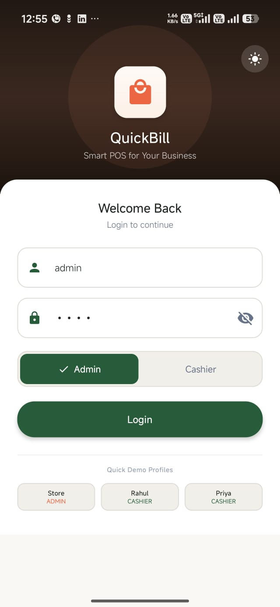
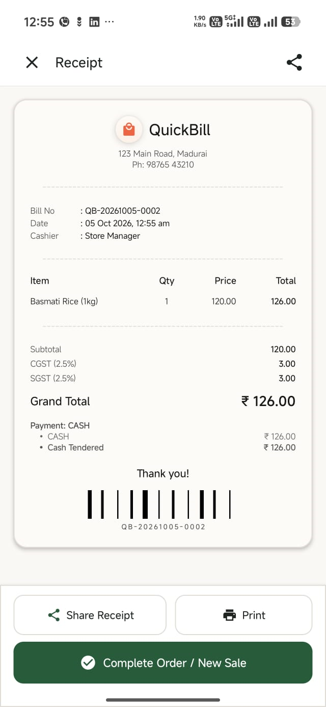
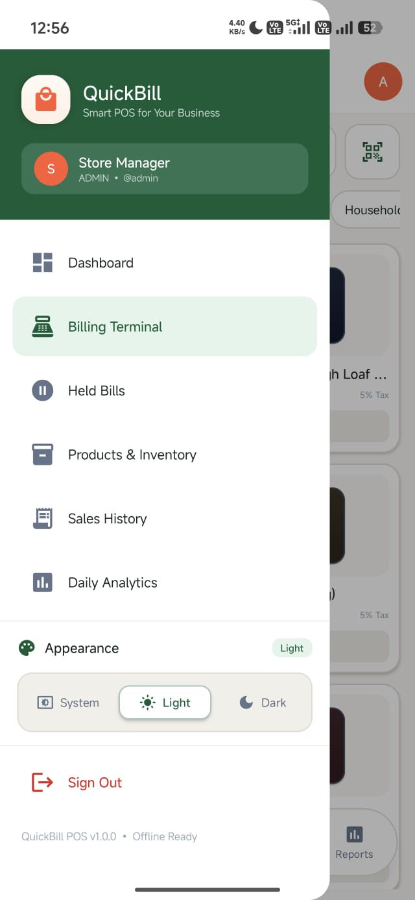
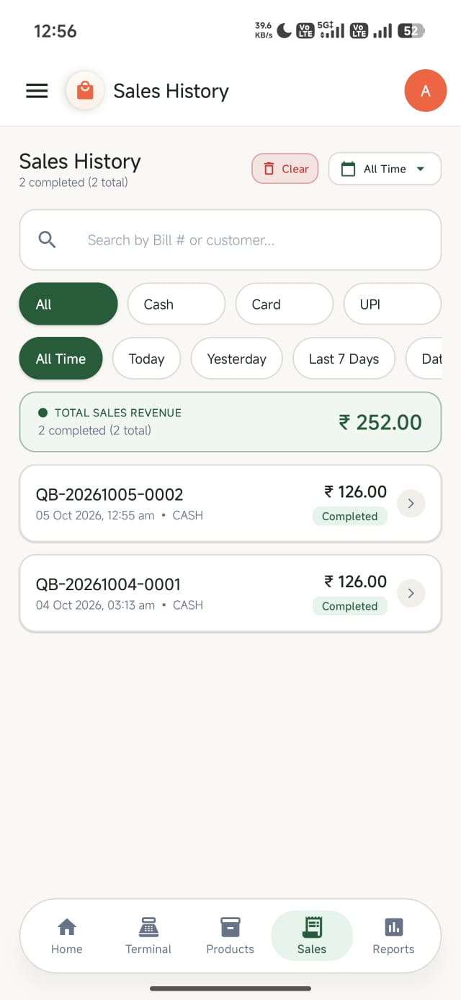
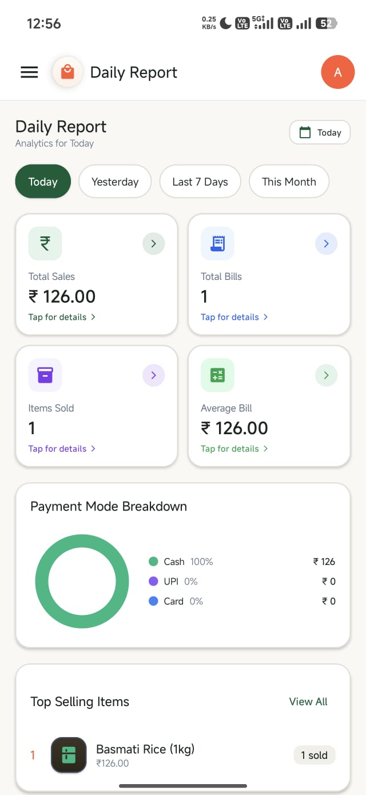

# QuickBill POS - Retail Point of Sale System

[](https://developer.android.com)
[](https://kotlinlang.org)
[](https://developer.android.com/jetpack/compose)
[](https://developer.android.com/topic/architecture)
[](https://developer.android.com/training/data-storage/room)

**QuickBill POS** is a modern, offline-ready Android Point of Sale (POS) and inventory management system designed for supermarkets, retail grocery stores, and quick-service shops. Built entirely with **Kotlin**, **Jetpack Compose (Material 3)**, and **MVVM Clean Architecture**, QuickBill provides a frictionless checkout experience for cashiers with instant barcode scanning, accurate GST calculation, flexible discounts, split payments, and thermal PDF receipt generation.

---

## 🌟 Key Features

### 1. Must-Have Core Features
- **Cashier Authentication & Login**:
  - Secure 4-digit PIN authentication with on-screen numeric keypad.
  - Multi-user role support (Store Manager / Admin vs Cashier).
  - 1-tap quick cashier selector for instant demo testing and fast lane handover.
- **Product & Inventory Management**:
  - Full CRUD: Add, edit, soft-delete products.
  - Fields: Name, SKU / Barcode, Category, Price, Tax Rate (0%, 5%, 12%, 18%, 28%), Stock Quantity, and Min-Stock Alert threshold.
  - Real-time stock availability indicators with low-stock badges.
  - Quick-stock steppers (`-1`, `+1`, `+10`) directly on product cards.
  - Strict block on selling out-of-stock items (cannot add or checkout if unavailable).
- **Billing Terminal & POS Checkout**:
  - Fast search by product name or SKU/barcode.
  - Category filter chips (Groceries, Dairy, Beverages, Snacks, Personal Care, Household).
  - Touchscreen cart management: adjust quantity (`+` / `-`), remove line items, clear cart.
  - Real-time inventory check preventing cashier from exceeding in-stock items.
  - **Park / Hold Cart**: Pause an order to serve the next customer, with a dedicated Parked Orders screen to resume anytime.
- **Flexible Discounts**:
  - **Per-item discount**: Apply percentage (%) or flat amount (₹) directly on individual items with savings breakdown.
  - **Whole-bill discount**: Percentage (%) or flat amount (₹) applied across the entire bill.
  - Clamping safeguards preventing discount from exceeding item or bill subtotal.
- **GST-Style Per-Item Tax Calculation**:
  - Dual GST breakdown: Accurate **CGST** and **SGST** calculations per item and whole-bill total.
  - Accurate financial rounding using `BigDecimal` (`HALF_UP`) to ensure exact paise/rupee matching.
- **Payment & Split Tender**:
  - Modes: **Cash**, **Card**, **UPI**, and **Split Payment**.
  - **Cash**: Instant calculation of amount tendered and change due, with fast round-up tender chips (`Exact`, `+50`, `+100`, `+500`).
  - **Card**: Optional transaction approval code or last 4 digits tracking.
  - **UPI**: Simulated dynamic merchant QR code + UPI ID (`quickbill.store@pos`).
  - **Split Payment**: Allocate distinct amounts across Cash, Card, and UPI with live remaining balance tracking.
- **Thermal & PDF Receipts**:
  - Generates professional 80mm-style thermal receipts.
  - Displays Store Name, GSTIN, Bill Number, Date/Time, Cashier Name, Line Items, GST Tax Breakup (Rate, CGST, SGST), Payment Breakdown, and Change Returned.
  - Native **PDF generation** with Android Share sheet (send via WhatsApp, Email, or Print).
- **Sales History & Refund / Void with Stock Restoration**:
  - Searchable past bills with date range filters (`Today`, `Yesterday`, `Last 7 Days`, `All Time`).
  - Filter by status (`Completed`, `Refunded`).
  - **Refund / Void**: In a database `@Transaction`, marks the bill as `REFUNDED` and **automatically restores inventory stock** for all purchased items.
- **Daily Analytics & Reports**:
  - Performance cards: Total Sales, Total Bills, Paid vs Refunded counts, Average Order Value.
  - Payment-mode distribution bar and percentage breakdown (Cash vs Card vs UPI).
  - **Top 5 Selling Items** leaderboard by units sold and revenue generated.

### 2. Nice-to-Have (Bonus) Features Included
- ✅ **Offline-First with UI Acknowledgment**: Built with Room local SQLite. Features a live Network Monitor with online/offline chip indicator in the top bar.
- ✅ **Barcode Scanner**: Integrated **CameraX + Google ML Kit Barcode Scanning** with targeting reticle, plus quick manual barcode entry.
- ✅ **CSV / Excel Export**: One-tap export of Inventory, Sales Bills, and Daily Reports to standard `.csv` files with Android Share sheet.
- ✅ **Dark & Light Mode**: High-contrast, cashier-optimized Material 3 color palette in both Dark and Light themes.
- ✅ **Thorough Unit Tests**: Dedicated JUnit tests verifying GST tax calculations, discounts, split payments, and cash change logic.

---

## 📱 Application Screenshots

| Cashier Login | POS Billing Terminal | Live Cart & Discounts |
|:---:|:---:|:---:|
|  |  |  |

| Payment & Split Tender | Thermal Receipt & PDF | Navigation Drawer |
|:---:|:---:|:---:|
|  |  |  |

| Product Inventory Management | Sales History & Refunds | Daily Analytics & Top Items |
|:---:|:---:|:---:|
|  |  |  |

---

## 🏗️ Architecture & Tech Stack

QuickBill follows Google's recommended **Modern Android Architecture (MVVM + Clean Architecture)**:

```
com.quickbill.pos/
├── QuickBillApp.kt                     # Application initialization, Room DB & sample seeder
├── MainActivity.kt                     # Jetpack Compose root, NavHost, Drawer & TopBar
│
├── data/
│   ├── local/
│   │   ├── QuickBillDatabase.kt        # Room database with TypeConverters
│   │   ├── dao/                        # DAOs: ProductDao, BillDao, BillItemDao, UserDao, HeldCartDao
│   │   └── entity/                     # Entities: ProductEntity, BillEntity, BillItemEntity, etc.
│   ├── model/                          # Enums, CartItem, CartSummary, PaymentSplit, DailyReportData
│   ├── repository/                     # AuthRepository, ProductRepository, BillingRepository, ReportRepository
│   ├── seed/                           # SampleDataSeeder (Preloaded catalog, cashiers & bills)
│   └── util/
│       ├── BillingCalculator.kt        # Pure Kotlin unit-testable GST & discount math engine
│       ├── PdfReceiptGenerator.kt      # Native Android PdfDocument receipt generator
│       ├── CsvExporter.kt              # CSV generation for bills, inventory, reports
│       └── NetworkMonitor.kt           # ConnectivityManager network status observer
│
├── ui/
│   ├── navigation/                     # Destinations: Login, Billing, Products, History, Reports, HeldCarts
│   ├── theme/                          # Material3 Color, Type, Theme tokens
│   ├── components/                     # QuickBillTopBar, NavDrawer, Keypad, BarcodeScanner, PaymentDialog, ReceiptDialog
│   └── screens/
│       ├── auth/                       # LoginScreen & LoginViewModel
│       ├── billing/                    # BillingScreen, BillingViewModel, HeldCartsScreen
│       ├── products/                   # ProductsScreen & ProductsViewModel
│       ├── history/                    # SalesHistoryScreen & SalesHistoryViewModel
│       └── reports/                    # DailyReportScreen & ReportsViewModel
│
└── test/
    └── BillingCalculatorTest.kt        # Unit tests for tax, discounts, payments, change
```

### Core Technologies
- **Language**: Kotlin 2.1.0
- **UI Framework**: Jetpack Compose with Material 3 (BOM 2024.12.01)
- **Local Persistence**: Room Database 2.6.1 with KSP (Kotlin Symbol Processing)
- **Concurrency & State**: Kotlin Coroutines & `StateFlow`
- **Navigation**: Navigation Compose 2.8.5
- **Camera & Barcode**: CameraX 1.4.1 + Google ML Kit Barcode Scanning 17.3.0
- **Document Generation**: Android `PdfDocument` API + FileProvider

---

## 🧮 Business Logic & GST Calculation Formulas

QuickBill's calculation engine ([BillingCalculator.kt](app/src/main/java/com/quickbill/pos/data/util/BillingCalculator.kt)) enforces strict financial precision:

### 1. Item-Level Calculations
- **Gross Amount**:
  $$\text{Gross} = \text{UnitPrice} \times \text{Quantity}$$
- **Item Discount**:
  $$\text{ItemDiscount} = \begin{cases} \text{Gross} \times \left(\frac{\text{Percent}}{100}\right) & \text{if PERCENTAGE} \\ \min(\text{Gross}, \text{FlatAmount}) & \text{if FLAT} \end{cases}$$
- **Taxable Amount**:
  $$\text{Taxable} = \text{Gross} - \text{ItemDiscount}$$
- **GST Components (CGST + SGST)**:
  $$\text{CGST} = \text{Round2}\left(\text{Taxable} \times \frac{\text{TaxRate} / 2}{100}\right)$$
  $$\text{SGST} = \text{Round2}\left(\text{Taxable} \times \frac{\text{TaxRate} / 2}{100}\right)$$
  $$\text{TaxTotal} = \text{CGST} + \text{SGST}$$
- **Line Total**:
  $$\text{LineTotal} = \text{Taxable} + \text{TaxTotal}$$

### 2. Whole-Bill Discount & Proportional GST Adjustment
When a whole-bill discount is applied, it is deducted from the net taxable amount and apportioned proportionally across individual items so that the resulting CGST and SGST remain strictly compliant with Indian GST standards.

### 3. Cash Tendered & Change Due
$$\text{ChangeDue} = \begin{cases} \text{CashTendered} - \text{CashDue} & \text{if CashTendered} \ge \text{CashDue} \\ 0 & \text{otherwise} \end{cases}$$

---

## 🚀 Setup and Build Instructions

### Prerequisites
- JDK 17 or JDK 21 (Set `JAVA_HOME`)
- Android SDK with platform `android-35` and build-tools `35.0.0`
- Git

### Build Debug APK
Run the Gradle wrapper from the project root:

```bash
# On Windows PowerShell:
$env:JAVA_HOME = "C:\Program Files\Android\Android Studio\jbr" # or your JDK 21 path
.\gradlew assembleDebug
```

The compiled APK will be generated at:
```
app/build/outputs/apk/debug/app-debug.apk
```

### Run Unit Tests
```bash
.\gradlew test
```
All unit tests in `BillingCalculatorTest` will execute and generate an HTML report under `app/build/reports/tests/testDebugUnitTest/index.html`.

### Install on Device or Emulator
```bash
adb install -r app/build/outputs/apk/debug/app-debug.apk
adb shell am start -n com.quickbill.pos/.MainActivity
```

---

## 🔑 Pre-Loaded Seed / Sample Data

On the first launch, QuickBill automatically seeds realistic data into the local Room database:

### Default Cashier & Admin Users
| Role | Full Name | Username | PIN |
|---|---|---|---|
| **Store Manager** | Store Manager | `admin` | `1234` |
| **Cashier 1** | Rahul Sharma | `cashier1` | `0000` |
| **Cashier 2** | Priya Patel | `cashier2` | `1111` |

*(Note: You can also tap any quick-select button on the login screen to sign in instantly!)*

### Sample Products Catalog
The database includes 19 pre-configured products spanning all major grocery departments:
- **Groceries**: Basmati Rice 1kg (5% GST), Whole Wheat Atta 5kg (0% GST), Toor Dal 1kg (5% GST), Sugar Crystals (5% GST), Sunflower Oil (5% GST).
- **Dairy**: Amul Butter 500g (12% GST), Fresh Paneer (5% GST), Greek Yogurt (**Low Stock demo: 2 left**), Full Cream Milk (**Out of Stock demo: 0 left**).
- **Beverages**: Roasted Coffee Beans (5% GST), Green Tea (5% GST), Sparkling Soda Can (28% GST), Cold Pressed Orange Juice (12% GST).
- **Snacks**: Dark Chocolate Almonds (18% GST), Baked Potato Crisps (12% GST), Artisan Sourdough Loaf (5% GST).
- **Personal & Household**: Moisturizing Bath Soap (18% GST), Herbal Toothpaste (18% GST), Liquid Dishwash Gel (18% GST).

---

## 🧪 Unit Testing Summary

Unit tests in `app/src/test/java/com/quickbill/pos/BillingCalculatorTest.kt` validate:
1. `testEmptyCartReturnsZero`: Verifies zero subtotals, taxes, and items count.
2. `testStandardBillingWithGst18`: Tests a ₹100 product x 2 at 18% GST resulting in ₹36 GST (CGST ₹18 + SGST ₹18) and ₹236 grand total.
3. `testPerItemPercentageDiscount`: Tests a ₹200 item with 10% discount and 12% GST.
4. `testPerItemFlatDiscount`: Tests a ₹150 item x 2 with ₹50 flat discount and 5% GST.
5. `testWholeBillDiscountPercentage`: Tests 10% whole-bill discount and proportional GST adjustment.
6. `testWholeBillDiscountFlat`: Tests ₹100 flat whole-bill discount.
7. `testDiscountCannotExceedSubtotal`: Tests that excess discounts are clamped to 100% of taxable total.
8. `testCashTenderedAndChange`: Tests exact tender, excess tender, and under-tender edge cases.

---

## 📄 License
This project is open-source under the MIT License.
